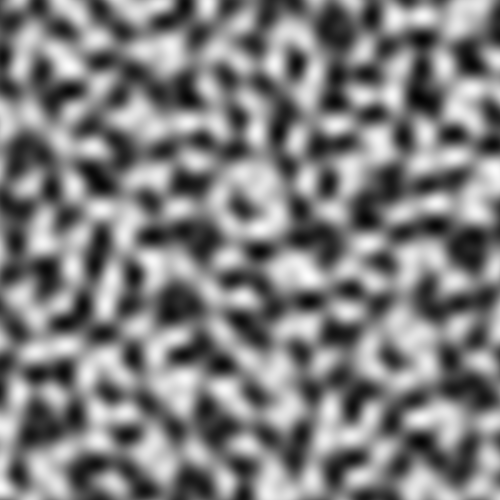
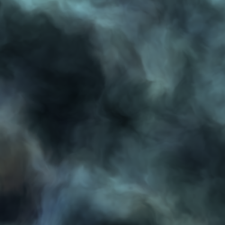

# Entry 1 - Project & Implementation Ideas
The basic idea for the project is to create a procedural island (with a road network as a stretch goal),
built around Unity's Burst compiler and job system to allow for huge islands.

This project will utilise Simplex Noise, layered as a fractal - creating Fractal Simplex Noise.

If cities are possible to complete in the given timeframe, these will be generated by the Wave Function Collapse algorithm.

Roads would be generated by spawning a set of "cities" using poisson disk sampling that require major road connections,
along with towns that these major road connections are somewhat pulled towards.
Minor road connections would be generated between these smaller towns either to a major road if one is nearby, or directly to a city if no other road is nearby.
Roads could also utilise turbulence and/or contours of the heightmap to generate.

An example of turbulence:

Image Source - [The Book of Shaders by Patricio Gonzalez Vivo & Jen Lowe](https://thebookofshaders.com/13/)

## Utilising Burst / the Job System
For this project I will utilise Burst and the Unity Job System.
This is because of the intended use for the terrain generator - racing games.

As the player has to move very quickly in a racing game,
the world needs to be able to generate quickly to keep up.
The world also has to be huge to allow for high speeds in the first place,
otherwise by the time you're up to speed you'll already be at the edge of the world.

Since world generation is an extremely heavy task in of itself that has to run for every vertex on the mesh,
an efficient parallel implementation is vital to achieve this.
A standard single-threaded implementation can only run so fast,
especially with modern CPUs leaning more heavily into multithreading performance over single-threaded.
Burst and the Job System is therefore a perfect fit for the project.

### Architecture
Due to the limitations of the Job system and Burst compiler,
developing an efficient algorithm requires a complete rethink to programming architecture - generally moving away from Object-Oriented programming.
Some aspects of the algorithmic requirements are below:
* Structs are used instead of classes due to their property of being value types rather than reference,
meaning it does not allocate on the heap (reducing Garbage Collection) and also ensuring memory safety between the threads.
* Stateless design is required through jobs to ensure that they can be parallel and that no two results rely on each other.
* Branching is to be avoided wherever it is possible: branches hurt Burst's ability to perform vectorisation on loops.

Developing a world generator to these requirements will be an interesting challenge and a huge learning experience.

## Creating the terrain
To generate the terrain, I will use the afformentioned Simplex Fractal Noise,
as it offers a smooth and natural looking texture which can then be interpreted as a property for the terrain - such as a biome map or height map.
However, a single layer of Simplex Noise can look unrealistic and flat, due to its lack of detail.

Image Source - [The Book of Shaders by Patricio Gonzalez Vivo & Jen Lowe](https://thebookofshaders.com/11/)

This problem can be overcome by adding more layers (octaves) of Simplex Noise, at different scales and amplitudes.
This has the effect of adding extra detail into the terrains,
making it look more natural instead of just being rolling hills and valleys.

An example of Simplex Fractal Noise (as Fractal Brownian Motion):

Image Source - [The Book of Shaders by Patricio Gonzalez Vivo & Jen Lowe](https://thebookofshaders.com/13/)

This is a similar concept to how sound is composed of only layered sine waves of different wavelengths.

The terrain could be further shaped by using AnimationCurves to add more variety.

## Creating an island
To generate this island, I will be using fractal simplex noise with a mask applied.
This mask will be generated by first creating a mesh from a random set of angles, along with a set of extrusions generated from 1D smooth noise.
This mesh will then be rendered on the GPU via a custom shader that will add jittering (if required) to the vertices
and also apply a gradient filter to the result. This result could also be smoothed via an image effect shader if required.

Once this mask has been generated, the heightmap can be multiplied by it to shape the island.

## Noise implementation
I found an old implementation of 2D simplex noise I developed in the past,
created from translating a [GLSL shader](https://github.com/ashima/webgl-noise/blob/master/src/noise3D.glsl) into C#/Burst code.
I can utilise and modify this implementation for most of the 2D noise maps required for the island generation.
