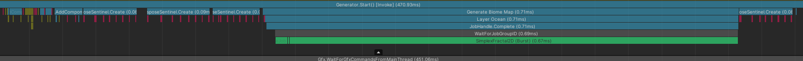
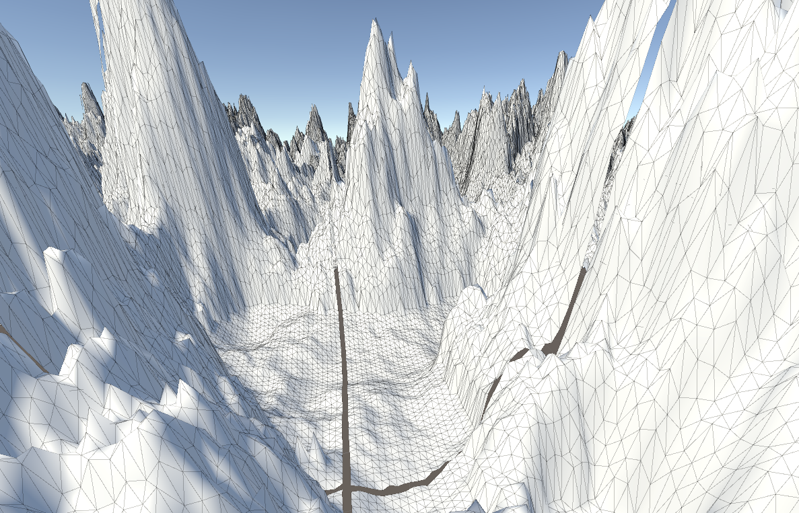

# Entry 7 - Biome Revamp (Now with Blending!)
This week I decided to try and implement blending on the biomes
and generally speed up the entire system where possible,
as the current implementation is limited to running on / blocking the main thread.

# Stopping the biome generation from blocking the main thread
The original implementation blocked the main thread while the biome map generates.
This caused a bottleneck in the generation code and was the biggest contributor to generation time.

To fix this, I made the biome spawner take in the previous biome's spawner JobHandle.
This allowed each spawner to set the previous one as a dependency,
allowing the whole spawner chain to run in the background without blocking the main thread.

This change in operation will tie well into the biome revamp.

# The Biome Revamp
This was a huge task and ended up taking way longer than I originally thought it would.
Originally, the task was to just add blending between the biomes.
The issue preventing me from doing so with the current system was how I would store the weighting / blending data.

With the current system, the biomes are stored as a 2D array of integers,
referring to the biome's index in the lookup array.
This makes it impossible to store blending data in the biome map,
as there's only one biome being stored, and no weighting data.

## Design of the new solution
To solve this, I decided to change the way the biomes are stored.
The integer array was swapped to a float4 array,
allowing the 4 highest weighted biomes at any point to be stored with weights.
The integer component of the float will still correspond to the biome index in the array like previously.
However, the fractional component of the float will be used to store the weighting of that biome.

### Performance considerations
Overall, this may take longer to generate the biome map as there's an additional packing step,
but will most likely save on memory and bandwidth
(and VRAM if doing procedural texturing on the GPU using the data).
The Vector4 format also allows the CPU to more easily perform operations in parallel on the biome data,
since each sample can fit neatly into an XMM register.

## Implementation
The first thing I did to implement this new system was change the biome's current spawn function to act
more like a weighting function.
Now upon generating the biome map, the weights of all biomes are collected into a large sliced up array.

### Packing
After the biome's map is generated, it is passed into a "packing" job.
This job will check if the biome's map is greater than all the values at the given sample in the overall biome map.
If the biome weight is greater than any biome already in the sample,
it will overwrite the lowest biome in the sample.

### Applying Biomes to the Heightmap
#### A thread-safe AnimationCurve
One of the problems I faced with the new parallel biome system was the fact that AnimationCurves are not value types.
This means that they're not thread safe or compatible with the Job system or Burst.

From reading a forum post [here](https://forum.unity.com/threads/need-way-to-evaluate-animationcurve-in-the-job.532149/)
and 5argon's repository [here](https://github.com/5argon/JobAnimationCurve),
I implemented the cubic hermite spline function and wrote a wrapper
to grab the keyframes from the AnimationCurve and store them in NativeArrays so that the job can sample them.

This ended up taking a lot longer than expected due to me trying different approaches
and at one point trying to make my own AnimationCurve editor,
but this approach ended up working best.

#### Blending the Biomes
To blend the biomes together, I sampled the fractional part of the biome maps,
discarded any biomes from being considered over the blending threshold,
multiplied the AnimationCurve samples by the weights,
then took the average of the multiplied samples.
The heightmap is then multiplied by this final multiplier map at the end of the job.

## Result
The result seems to work very well,
as shown from this very exaggerated test between a very low biome and a very mountainous biome:

There's still very obvious seams in the mesh generation at the moment
as I haven't yet wrote the code to stitch them together, which will be next week's priority.

Overall, I'm very happy with how this biome revamp has turned out.
The data structure will also be very easy to pass to and sample from the GPU
and could allow me to implement procedural texturing via the biome map and a Texture Array.
