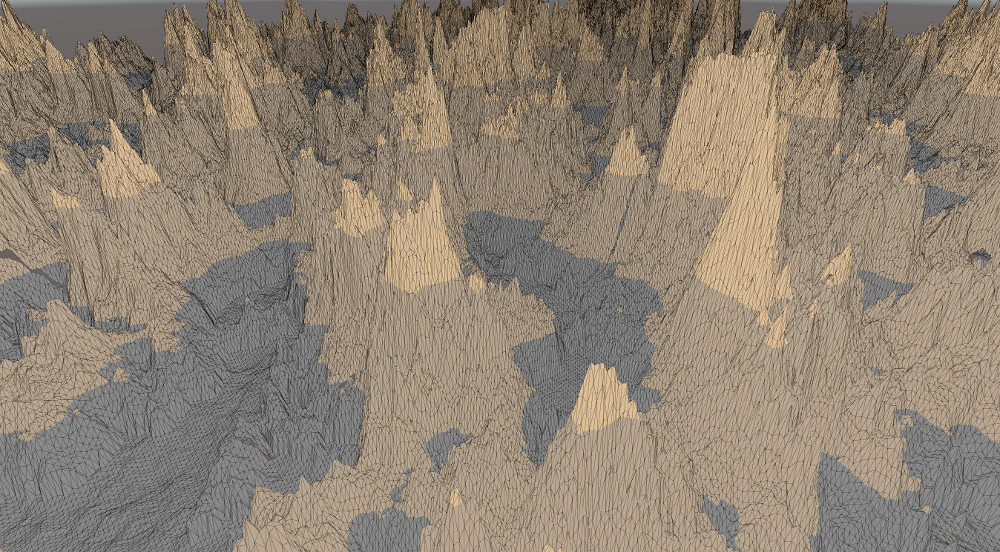

# Entry 8 - Attempted seam fix & Biome Texture Blending
# Fixing the mesh seams
Currently, the result of the mesh generator has 1m wide seams at the edge of each chunk.
This is due to the fact that the meshes are being generated 0-127, then 128-255, given a size 128.

Blending the meshes together isn't as simple as just adding 1 to the meshes,
as state doesn't exist between the chunks and the seams still exist.
The heightmap either needs to be blended between each chunk in an aditional step,
or the issue causing the same points in the heightmap not being consistent needs to be fixed.

Having tested the biome maps with the biome texture blending section below,
the problem definitely lies within the noisemap generation
and most likely will have to be fixed in the future after the deadline.

# Biome Texture Blending
## Design of the Implementation
The main task this week was to extend the biome blending to the texturing of the terrain.

The approach I decided to use for the texturing would be to do it in real time in a shader.
This is because the textures would remain in memory as-is and no extra VRAM
would have to be used to generate chunk-specific textures,
which would be the case in a Compute Shader.

This would be possible through the use of Texture2DArrays,
which are effectively 3D textures where the 3rd dimension is which layer in the array.
The texture of each biome will be added to the array at the biome's index
so that the indices in the biome map can look up the textures in the array.

Blending would be done similarly to the heightmap blending,
though float4s (colours) would be blended rather than a float (heightmap).

## The Implementation
I started the implementation by translating the heightmap blending code to HLSL
and writing the basic boilerplate shader code to transform
Object Space to Clip space and pass UVs to the fragment shader.

The biome map data will be passed per-vertex into the shader rather than as a big buffer,
since this was easier to implement and makes more sense to me.

Next up was working on the C# side of the implementation.
This involved iterating through the biomes and copying the
textures from each biome into the texture array.
This only has to be performed on initialisation of the biome map.

Overall, this was the result for now:

This shows that all the data is being passed and is working correctly,
though more testing is needed - along with using the UVs of the texture.

# What next?
Next week will mostly be focused on code cleanup and fixes ready for the deadline.
Procedural texturing will also have some improvements done to it if there is enough time.
