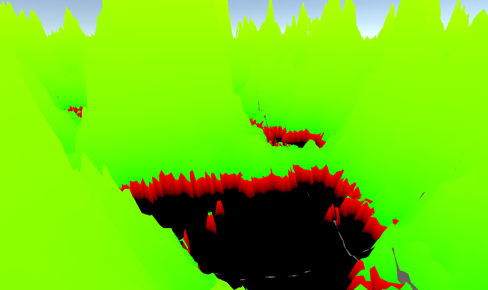
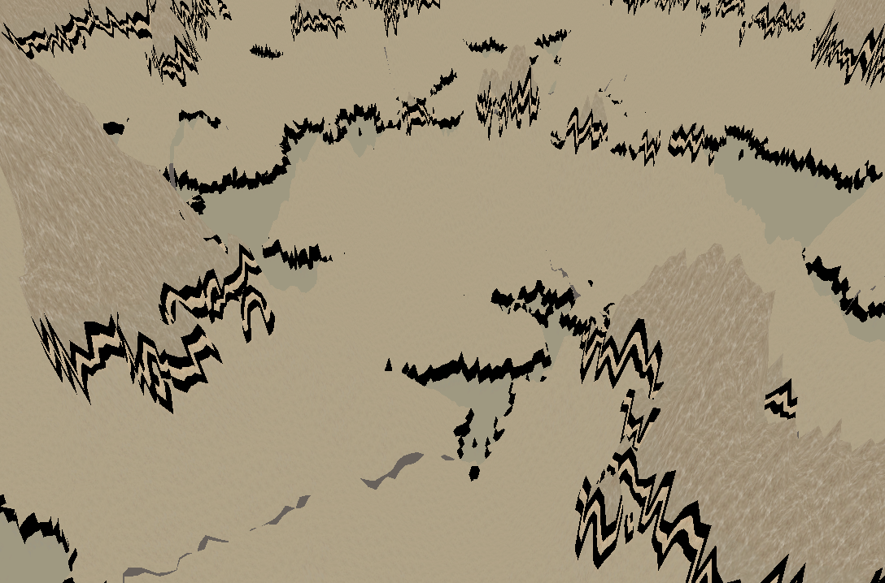
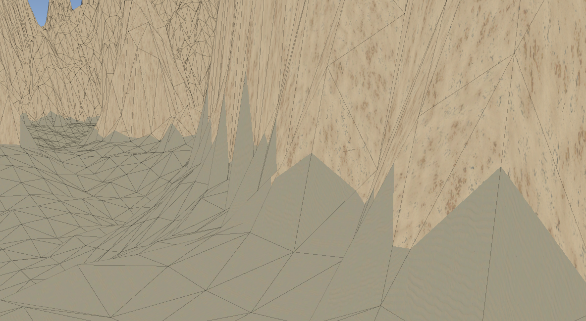
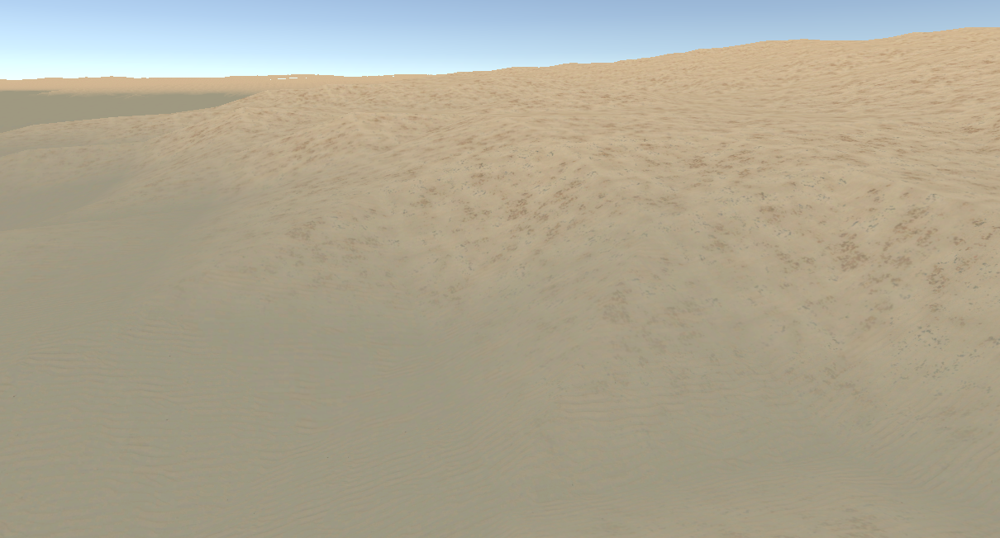

# Entry 9 - Biome Texturing/Blending Fix, Refractoring & Code Cleanup
# Procedural Texturing Fixes
One of the biggest issues I faced this week after working on the Procedural Texturing
was that there were some artefacts whenever the biome changed from one to another.

After a lot of testing, I found that the issue was the way the biome map
was being passed between the vertex and fragment shader
as I forgot that shaders interpolate the values.

Since the biomes are being stored as an index in the integer portion and a weight
in the fractional portion, the interpolation would put the weights all the way up to
0.99, loop back around to 0.00 once the index changed,
then return to be correct at the next vertex.

Here is a visualization of the problem:

I temporarily fixed this issue by adding the `nointerpolation` property to the
biome map parameter, which ended up with this as the result:

This caused the biome transitions to be jarring, but no longer wrong.

I later properly fixed this by splitting the integer part
and fractional part of the biome map into two values in the vertex shader,
to then be interpolated to the fragment shader.
This ended up with a perfectly smooth transition like here:

During fixing the artefacting, I also changed how the blending works to use weighted average
rather than the original clamped weighted average in order to reduce possible sources of issues.
This might be reverted back in the future.

# Code Cleanup
For the majority of this week, I focused on fixing up the code to be more presentable and maintainable,
since a lot of the features I recently implemented were rushed to try and flesh out and polish the project.
This means some time is needed to bring the code up to standard.

The result of this will still feel the same to play and use,
but will make future development much easier.

I also found many areas that I would like to improve in the future,
such as possibly having custom heightmaps per biome.
