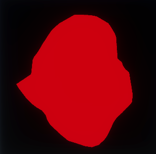

# Entry 2 - Mask Implementation
The first task I decided to tackle was mask generation.
I was given a suggestion of generating a mesh to then fill in to create a mask,
which I have decided to try to implement.

# Design
The generation of the mask would be done in several steps:
* Generate a set of angles between `-Pi + Epsilon` and `Pi`,
* Generate a set of extrusions to apply to these angles using 1D smooth noise.
* Apply the extrusions and calculate a set of vertices.
* Pass vertices to fragment shader to generate a texture of the mask.
* Possibly apply blur to texture as a post process effect?
* Read texture back to CPU for other steps to use.
* Possibly make the texture readback asynchronous to avoid stalling the GPU for multiple frames.

Overall, I decided against compute shaders for any of the generation steps as they can be unstable on certain GPU drivers
and would hurt hardware compatibility, as DX11 or OpenGL 4.3 hardware would be required.

# Implementation
## Generating the vertices in the vertex shader
My original idea for the implementation was to generate the vertices on the vertex shader rather than the CPU.
This would be done by uploading just one float of the angle of the sample in the vertex buffer and calculating the vertex from there.
However, all attempts to do this would just crash Unity, or not work at all.
I could probably implement the vertex generation in the vertex shader in the future given enough time,
but for the scope of this project, it's not worth doing currently.

I would like to explore this solution in the future though
as a vertex shader would offload a bit of work from the CPU which would have to be done on the GPU anyway
and save on some bandwidth.
Though, this wouldn't be high priority and more of a curiosity project,
since the work is light and offloaded onto an otherwise unused thread anyways.

### Alternative Solution
The alternative solution was to generate the vertices in a parallel job,
which would also be quick and off of the main thread,
which is the solution I have started implementing.

## Generating Extents with 1D Noise
After reading through the [Book of Shaders](https://thebookofshaders.com/10/)' section about randomness and noise,
I developed a simple implementation of a smooth 1D noise algorithm in Burst, to use for the mask's mesh generation.

I then used this algorithm in another job which runs in parallel to the angles job to create the set of extrusions.

## Generating the Vertices
To generate the vertices to be sent to the shader,
I wrote another parallel job that takes in the results from the angles and extents job and generates a set of vertices.
The job works by converting the angle into a direction vector, which is then multiplied by the given extent.

These results are then passed into the shader.

## The Shader
To generate the actual mask texture, I will use a simple vertex and fragment shader.

The vertex shader will only have to transform the Object Space position into Clip Space,
though in the future could jitter the vertices for more shape detail.

The fragment shader currently will only write a 1 for everywhere the mesh covers,
meaning the result will either be 0 or 1 for now.
In the future, a gradient could be applied to this.

The resulting RenderTexture is then read back onto the CPU, non-async while testing.

# The Finished Implementation
The implementation was finished this week, but it has a few issues.

The main issue to focus on in the next week is that the extents of the mesh generated are not normalised.
This was fixed just to create the image by scaling it in the render step.
This leads to issues where the mesh won't be in view or can intersect itself.

This issue can be fixed by adding a step to find the minimum and maximum value of the array,
to then use in an inverse lerp on the extents within the vertex generation step.
