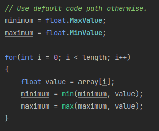
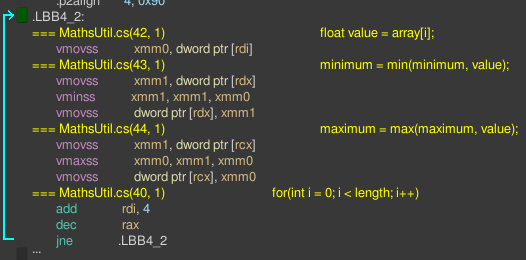
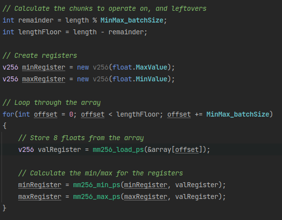
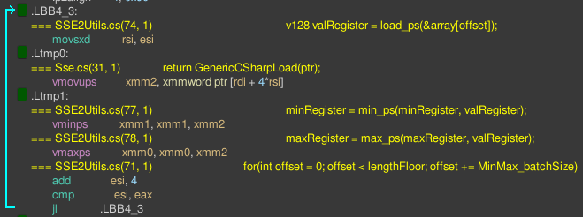
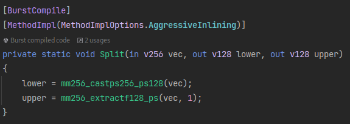
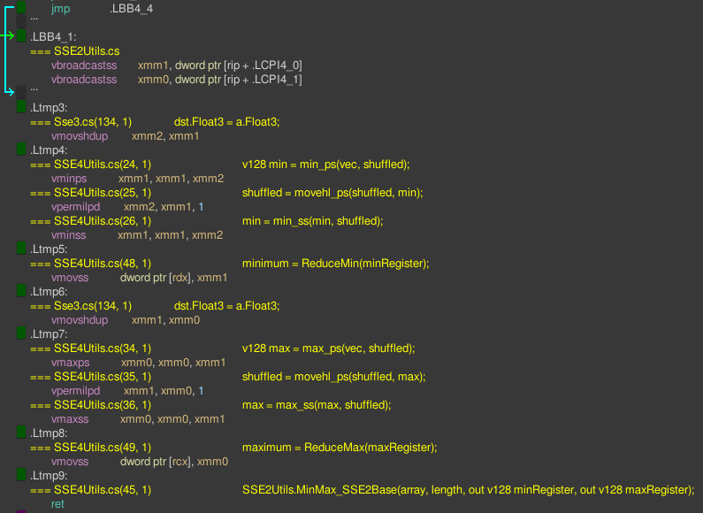
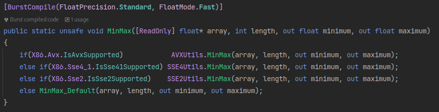
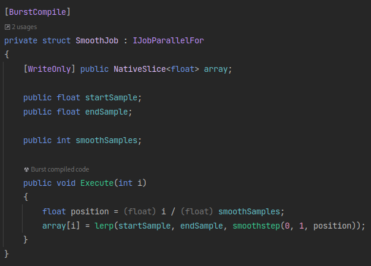
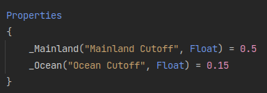
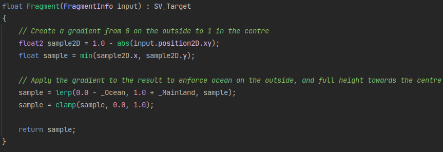

# Entry 3 - Mask improvements
## Normalisation of the mask extents
The first thing I implemented this week was a method to normalise the extents in order to keep the island to scale.
As this needed to read through the entire array and read/write a variable for each array access,
I decided that it would make sense to focus on a single threaded but vectorised implementation for performance.
This is because a mutex would be required on the minimum and maximum value as multiple threads are reading,
whilst one occasionally updates it.
This would heavily impact performance in comparison to a single threaded vectorised implementation.

### Original implementation
My original implementation looked like this:

And the disassembly (AVX2) of Burst's generated code is this:

As shown in the disassembly, Burst's generated code is mostly scalar,
moving one item into the xmm register per loop iteration.
This could be improved in the future and could possibly be a bottleneck to the mask generation,
as this runs in a single thread.

### SSE/AVX Intrinsics to improve performance
Improvements would be made by writing an AVX/SSE codepath with specific intrinsics to batch the work into XMM/YMM registers.
The Burst compiler comes with a handy set of intrinsics mapped to specific assembly instructions
under the `Unity.Burst.Intrinsics.*` namespace, which we can use to write a faster codepath if the CPU supports it.
I started by writing a naive implementation by just storing 8 values from the array and comparing it to a min and max value register,
setting that register to the new values if greater/lower.
As we are expecting a minimum batch size of 8, we can avoid having to finish the tail end of the array over the batch size.

This is the implementation below:

And this is the assembly generated by the AVX implementation:

As shown, this is much more efficient and taking full advantage of AVX - utilising the YMM registers fully.

From this point, we need to reduce the two registers into one value.
AVX512 has a very handy instruction for this operation: `_mm512_reduce_min_ps` and `_mm512_reduce_max_ps`.
However, AVX and SSE(x) does not have an equivalent to this instruction.
As well as AVX512 not being widely available yet and most likely not being so for the forseeable future.

To find out an efficient way to do this,
I found [an interesting post on StackOverflow](https://stackoverflow.com/a/35270026) by Peter Cordes.
This helped to find a very efficient SSE4 implementation for 128bit wide XMM registers,
which we can operate on after splitting the YMM register into two like so:

After implementing the SSE4 reduction operation from the answer, the reduction part of the final assembly looks like this:

The last thing to do was allow CPUs that don't have the AVX instruction set to use the old code path.
The Burst compiler has a built in compile-time check for this with `if(IsAvxSupported)`,
which the implementation of is here:

This was more of an exercise to learn how to use intrinsics with the compiler,
but the results seem to be successful and faster from initial profiling.
I probably will use intrinsics in the future to optimise clear bottlenecks where the compiler generates sub-optimal code.

## Reducing the sharp cut-off of the island once the angles wrap around.
As the angles are generated between -PI and PI radians (-180 to 180 degrees),
there is a point on the island generating where the vertices snap between two vastly different samples.

To solve this, I decided on smoothing out the last few samples of the extents with a parallel smoothing job.
This job smoothly interpolates between two given samples over the given slice of the array, removing the sharp edge.
The implementation is shown below:

And the results are shown here:

## Applying a gradient mask to the results
Since a shader is being used for the mask generation,
I can add in a step in the fragment shader that applies a simple gradient over the result.

This adds next to no overhead and runs entirely on the GPU, without even the need for a compute shader.

## Async texture fetch
The result texture is now fetched asynchronously from the GPU with a callback,
removing the main hitch from the generation method being called.

# Wrapping up
Overall, the past few weeks were mostly about getting the base shapes of the island to look correct,
which has now been achieved.

## Steps for the future
* The min/max function could be improved by tuning the 1D smooth noise function to always return a value between 0 and 1.
* Could add jitter to the vertex shader for more randomness on the shape of the island.
* Could add a blur image effect shader to the result whilst it's on GPU VRAM.
* Do more profiling in the future to remove bottlenecks.
