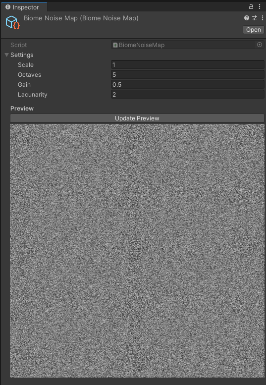
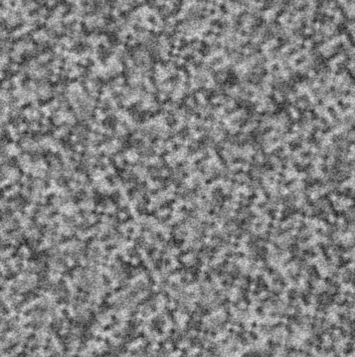

# Entry 4 - Inspectors & Biome Work
## Biome Inspector
This week was mostly spent implementing an inspector for the biome map to view the noise maps
and help with the development of the biomes.

The implementation was just a simple script to run the biome generator,
pack the result into a texture, then display that texture below the default inspector.

I then used this to test the noise algorithms and biome generator, which helped development.

## Noise fixes & normalisation
From using the new inspector, I tweaked the noise algorithm to always generate values between 0 and 1,
removing the need to run a normalisation step after generation.
This was required because of the fact that the world is generated in chunks,
so not all the values are available as not all chunks are generated.

The randomised offsets were also clamped to a more sensible range
since artefacts were creeping in from floating point precision issues.

Overall, this is what the end result of the noise was:

## Biomes
For the rest of the week, I started work on a biome system for the world generator.

As different climates in the real world are caused by different phenomena,
I decided that an abstract class design for the biomes would be best.
This would also allow for easy further extension in the future.
