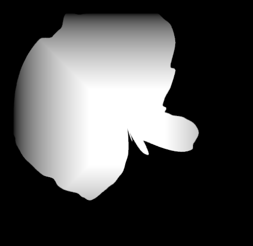

# Entry 4 - Mask Transform Fix, Gradient Fragment Shader & Async Texture Fetch
# Mask Transform Fix (Removal of HDRP)
One of the main issues I was facing with the mask shader was that the ortho matrix was not being used.
This turned out to be because of HDRP not utilising the same matrices as the standard pipeline.
As I didn't want to deal with the extra hassle of adding support for HDRP,
I decided to revert back to the built-in pipeline.
This fixed the issue and support for a Scriptable Render Pipeline can always be added back in the future.

# Gradient Fragment Shader
This week I also decided to add a gradient effect to the island mask to try and make
the transition between the sea and island more natural.

To do this, I added a step to the fragment shader that creates a box pattern gradient
which goes from 0 at the edges to 1 in the centre, using the UV.
An ocean level parameter and land level parameter were also added which scales this pattern.

The end result ends up looking like this:

In the future I'd try to find a way to apply this pattern in the shape of the mesh to further help
the mask blend naturally between land and ocean.
This might be possible by generating normals in the direction of the angles.
A circular gradient might also work better as the generated meshes are usually circular in shape.

# Async texture fetch
The result texture is now fetched asynchronously from the GPU with a callback,
removing the main hitch from the generation method being called.

This works by creating a callback that copies the texture into a NativeArray
once the CPU has downloaded the RenderTexture.
A callback can also be provided to the method which is called once the RenderTexture has been downloaded.
