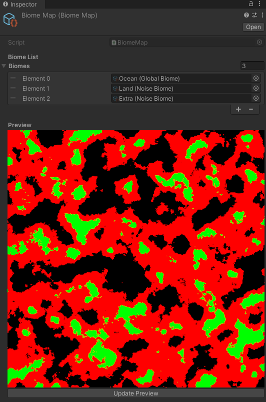
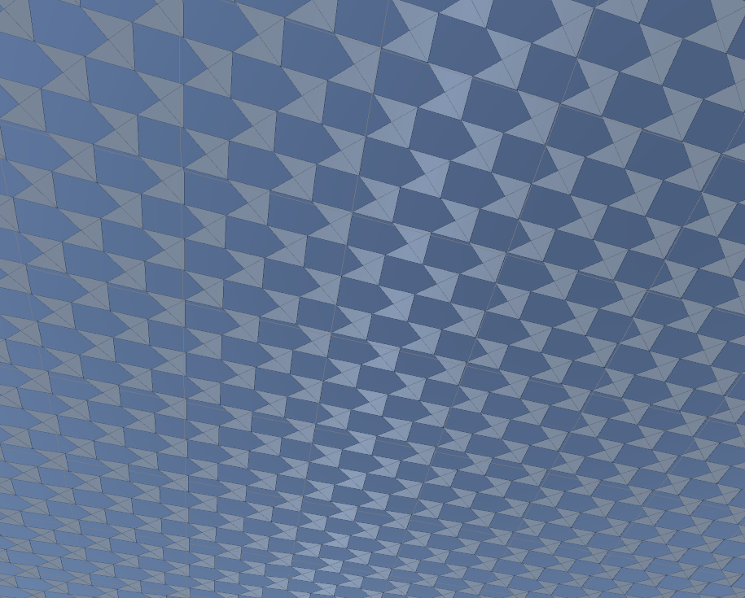
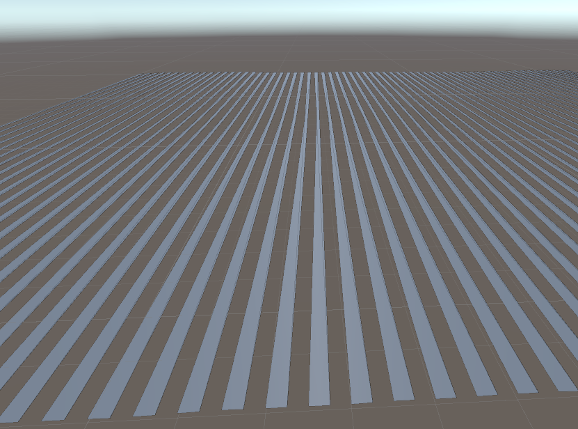

# Entry 5 - Finishing up Biomes & Mesh Generation
## Extending the inspector to masks
Since there are multiple assets that generate textures,
I made a generic "texture inspector" that each type could extend from.
It works in the same way across all the inspectors, cutting down on duplicate code.

Having more generated textures being visible has helped with customizing/fixing other bits of the code, so this has definitely been worth the effort.

## Finishing off the Biomes
This week was mostly spent trying to finish off the biome implementation.
This involved creating a seperate asset to store the biome list in and handle the biome map generation, along with a custom preview inspector:

Each colour is a different spawned biome, black being a global "Ocean" biome,
and the other two colours being noise biomes that are spawned with the same noise map
but at different thresholds.

### Storing the offsets for the noise maps
A lot of the issues I was facing this week were caused by figuring out
how to store the octave offsets for the noise maps.
This turned out to be a fairly major challenge if I wanted the previews to work in-editor,
due to how SerializedObjects are created/destroyed, destroying the stored offsets.

The end result was that the previews now only work in play mode,
and a special noise map asset to allow re-use of the same noise map for different purposes.

# Origin Shifting
I also started researching origin shifting as a way of getting around
the floating point precision issue of the large terrains.
I made a quick implementation where all the children of the shift gameobject shift back by
an amount once the given transform reaches the shift boundary,
but decided not to put it into the project.
This was due to the increased complexity and to focus on the higher priority areas of the project.
This should be quite quick to (re-)implement if needed though.

# Mesh Generation
I started to tackle the actual mesh generation this week to try and finish off the basics of the project.

This involved writing a set of jobs to calculate the vertices and indices of the mesh.

Originally, I wanted to generate the indices in parallel, though my original implementation had issues:

