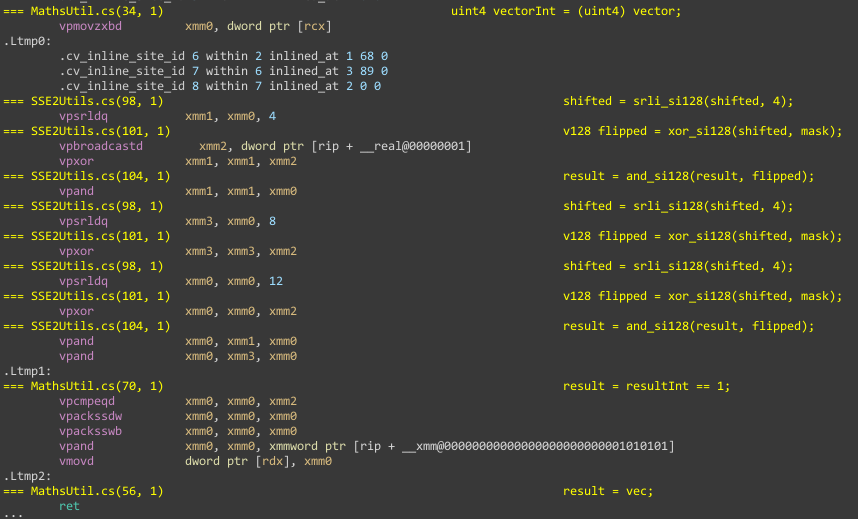

# Entry 8 - Slight performance improvements & Fixing the seams
# Replacing old Scalar Code
One of the small tasks I decided to tackle was a part of the packing job that refused to be vectorised by Burst.
Specifically, the code that makes sure that only one element gets replaced
in the biome map if the weight is greater than multiple entries.

The old code relied on scalar variables like so:

```CSharp
bool4 replace = isGreater & smallestWeight;
bool replaced = false;
for(int i = 0; i < 4; i++)
{
	replace[i] &= !replaced;
	replaced |= replace[i];
}
```

This created a bottleneck in the code that I wasn't expecting and I thought I could do better than the compiler's result.

To improve on this, I thought that the same task could be implemented
by comparing the vector with an AND operation a flipped right-shifted version of itself.
This would be possible in normal C# and I probably will make a non-SSE implementation in pure C#,
but for ease of implementation I decided to write it with SSE2 intrinsics
as I had the implementation idea in my head:

```CSharp
[BurstCompile]
static void MakeUnique(in v128 vec, out v128 result)
{
	result = vec;

	// Create xor mask to flip the bool vector
	v128 mask = new v128(1u, 1u, 1u, 1u);

	v128 shifted = vec;
	for(uint i = 0; i < 3; i++)
	{
		// Shift vector values right to next element
		shifted = srli_si128(shifted, 4);

		// Flip the shifted vector
		v128 flipped = xor_si128(shifted, mask);

		// Compare against result
		result = and_si128(result, flipped);
	}
}
```

The Burst compiler was then able to unroll this loop and convert it into a set of completely vectorised instructions:



## Nice. But why bother?
This was done more as a further personal exercise rather than explicitly for performance.
I enjoyed the exercise and it brought a performance gain.
Though currently, the biggest performance gain will come from making the mesh index generator parallel -
which I might do given enough time.

# Fixing the mesh seams
Currently, the result of the mesh generator has 1m wide seams at the edge of each chunk.
This is due to the fact that the meshes are being generated 0-127, then 128-255, given a size 128.

## Currently working on this now, sorry!
