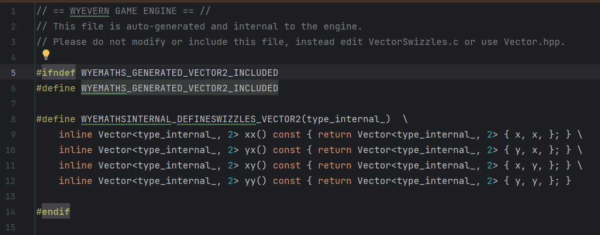

# A naive attempt at code generation.

## The maths library use case.
As a way to get back into programming outside of game engines after working on two long team projects,
I decided to start work on a maths library for Wyevern as a way to pick the engine back up off the ground.

For this library, I am using Unity's Mathematics library as a goal to achieve something similar to,
which in itself tries to emulate something similar to HLSL's syntax.

Part of this syntax requires a generated set of "swizzles" (.xyz, .xxx, .zzz, etc.) for the vector.
Whilst I could type each one of these out myself,
this would end up with somewhere around 400 different permutations that would have to be hand-typed
and hand-updated each time something about the methods needed to change.

And thus I had a use case for building a code generator.

## Basic first attempt
For this generator, I decided to write it in C.
This was because I'm not too big of a fan of C++'s string manipulation tools and much prefer's C formatting.
As this engine is written in C++, this wouldn't realistically add an extra dependency to the project either.

The first attempt was just a simple C script with everything hard-coded.
It got the job done and didn't really have any downsides other than expandability.

Results:

As I continued working on the maths library, I realised I'd need more use cases of code generation.
And thus, I decided to try and make this project re-usable.

## A second proper attempt
For this new system, I decided to continue using C, providing an API with a declarative syntax.
